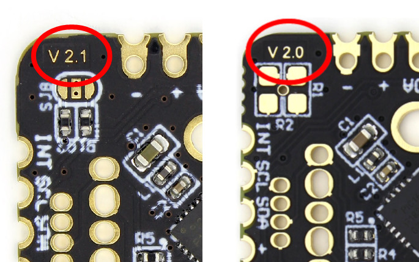

# I2C Encoder V2.1
--------------------------------------------------------------------------------
## This repository is for the HW version 2.1!
In the bottom edge it's written the board version. 
If it's written V2.1 you are in the right palce, if it's writte V2.0 you need to go [here](https://github.com/Fattoresaimon/I2CEncoderV2.1/releases/tag/V2.0.0).

## Introduction
The I2C Encoder V2.1 is a small board where you can use a classical mechanical encoder, or an illuminated RGB encoder on I2C bus.
The device has also 3 configurable GPIOs with the same footprint of RGB LED. It's possible to connect up to 127 boards in cascade and read all of them with the same I2C bus.
The I2C Encoder V2.1 has a series of 8 bit registers where it is possible to configure  the parameters and four 32 bit of registers. These 32 bit registers store counter value, value of increment steps, maximum and minimum thresholds.
Every time when encoder rotates at least one step, the counter value increases or decreases according to the rotation direction by the value of the increment steps register.
When the counter value is outside of the limit set by the thresholds registers, the counter value can be wrapped or can stuck on the threshold value reached.
I2C Encoder V2.1 also has an open-drain interrupt pin. It is set to logic low every time an interrupt occurs, the source of interrupt can be customized.

## Where you can get this board?
This project is avaiable on our [Tindie store!](https://www.tindie.com/products/Saimon/i2c-encoder-v2/)

## Repository Structure
* [Arduino Library:](https://github.com/Fattoresaimon/ArduinoDuPPaLib) Repository where you can find the Arduino IDE library for the DuPPa boards
* [Raspberry Library:](/Raspberry%20Library) Ready to use library in Python for the Raspberry board with example.
* [Firmware:](/Firmware) Project folder of Microchip MPLAB X contain the code running inside of the PIC16F18345
* [Hardware:](/Hardware) Folder containing the gerber file, schematic and BOM. 
* [Datasheet EncoderI2C V2.1:](EncoderI2CV2.1_v1.0.pdf) Datasheet of the board with the description of the registers and some useful information.

**The HW project is also available on [CircuitMaker](https://workspace.circuitmaker.com/Projects/Details/Simone--Caron/I2C-Encoder-V2)**

## Third-party libraries

* [C# / nanoFramework]( https://github.com/andylyonette/I2cEncoderV2)  thanks to  [Andy Lyonette](https://www.hackster.io/andy-lyonette)
* [PSOC](https://github.com/rudydevolder/DUPPA-i2cEncoder-for-PSOC) thanks to Rudy De Volder

   

**If you want to donate for my work, i would really appreciate it. You can donate here with this link. Thank you!**

